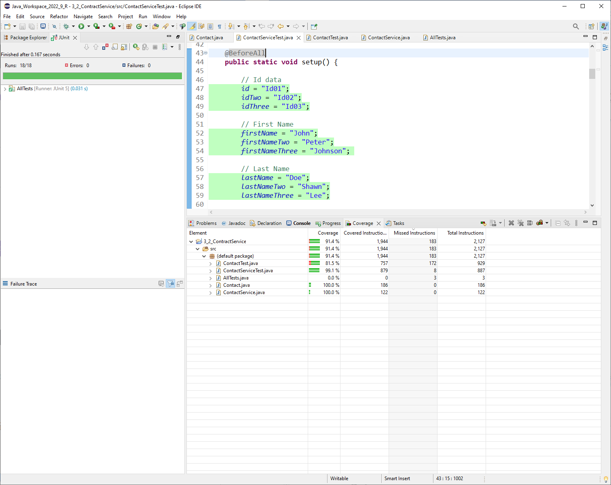

[Home](readme.md "Home") [Software Design and Engineering](CS320.md "Software Design") [Algorithms and Data Structures](cs300.md "Algorithms") [Databases](cs340.md "Databases") [Code Review](codereview.md "Code Review") 

---

## Software Testing, Automation, and Quality Assurance
## Software Design and Engineering Category

---

The artifact selected for this software design and engineering category is related to a Project completed during a course taken at (Southern New Hampshire University) CS320. This project was related to creating a Java-based Contact class along with a repository class to provide crude operations to manage the in-memory contact repository and service. The project also involved creating unit tests for both these classes Contact.java and ContactService.java. The application intends to manage contacts and uses Java HashMap for an efficient in-memory data repository and provides robust unit tests to validate the data input and intended functionality to improve the quality assurance of the artifact. To create this application, java’s JDK version 18 was used in combination with a famous Eclipse IDE. The Junit Test version 5 is used to test the boundary conditions, functionality, and data input validations. The Entity classes is used following the best coding standards using data encapsulation, constants, and robust functions to create and use Contact objects. The repository class used HashMap which is one of Java’s fastest collection frameworks with efficient insertion, retrieval, and deletion procedure runtimes. 

The selected artifact mainly consists of two Java classes and their associated Junit tests to validate their functionality. This application doesn’t involve user interaction which is why there is not Text-based  Interfaced or Graphical User Interface. The artifact was completed with best Java Programming practices for secure coding and following the standard Java Convections and naming schemes. The application is developed following the Software Design and development frameworks based on requirement analysis concluded from the given problem statement and requirements during the course module. The analysis is transformed into the Java Pojo class and its associated collection or repository class that exposes the functionality to manage the contact within the computer memory. 

    <picture>
    <source media="(prefers-color-scheme: dark)" srcset="assets/unittest.png">
    <source media="(prefers-color-scheme: light)" srcset="assets/unittest.png">
    
    </picture>
    
<em>Unit Testing Screenshot</em>

    <picture>
    <source media="(prefers-color-scheme: dark)" srcset="assets/codecoverage.png">
    <source media="(prefers-color-scheme: light)" srcset="assets/codecoverage.png">
    
    </picture>
    
<em>Code Coverage Screenshot</em>

The creation and enhancement of this application showcase the skills I learned during this CS320 course to learn about software development and quality assurance by creating automated unit tests to test and validate the functionality and correctness of the application. Dynamic application testing offers various advantages to achieve the robustness, correctness, performance, efficiency, and improved quality assurance of the application being developed.  Unit testing and quality assurance bring many competitive advantages to the software applications that undergo rigorous testing such as saving maintenance costs, consistent performance as expected, enhanced brand reputation, improved efficiency and operational performance, reduced bugs, and achieving compliance with the regulatory bodies. Testing functionality and boundary conditions through Unit testing ensure that an application will always produce the intended results for a given dataset. 

During the development and enhancement of this artifact, I followed the best coding standards and programming practices while closely adhering to the software design and development phases. I used an efficient data structure to manage the contact and wrapped it into a repository class classed ContactService. Java’s HashMap is one of its fastest data structures concerning its efficiency it has time and space complexity of O (N) and operations O (1) times at average and O(N) in the worst-case scenario. These runtimes prove that the chosen data structure is fast enough to service the requested CRUD operating for this in-memory contact repository. 
