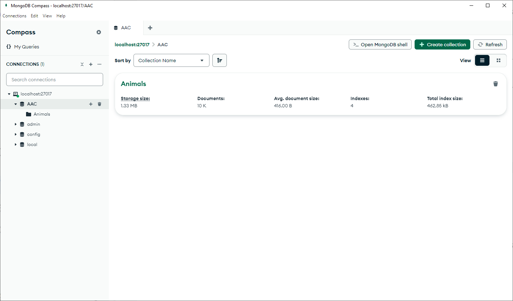

[Home](readme.md "Home") [Software Design and Engineering](CS320.md "Software Design") [Algorithms and Data Structures](cs300.md "Algorithms") [Databases](cs340.md "Databases") [Code Review](codereview.md "Code Review") 

---

## CS340 Client/Server Development
## Database Category

---

The selected Artifact is chosen from a project completed for the Course CS340 Client and Server Application Development. The application involves creating a document-based MongoDB NoSQL Database from a given Dataset comprising Animal data for a given Animal Shelter. The CS340 Client and Server Application Development course teaches how to plan, design, and develop client/server applications. The selected artifact is based on the creation of a NoSQL database from the given dataset. The suggested enhancement to this database application is related to creating Simple and Complex indexes to enhance the database search routines. MongoDB database systems help optimize and improve the execution of data selection or projection queries by incorporating indexes. Indexes support the efficient execution of the select queries to retrieve and filter the query-based data for its efficient and improved performance. Without indexes, the queries usually become sluggish, especially in the case of larger datasets. Incorporating indexes not only improves the database performance but also decreases the runtime of the query execution significantly. In the absence of Indexes, MongoDB scans every document present within the database which is like a brute force operation taking a lot of time and sluggish in preparing an output result. By introducing indexes, MongoDB limits the document related to that particular index and reduces the time complexity improving the runtime and database performance that helps develop robust and efficient systems that may produce results in real time without lagging the system. The indexes in MongoDB database System work by storing the specific field value or set of field values by the order of that particular simple or complex index. These ordered indexes match the query parameters and produce quality results filtered quickly as they are comprised of smaller datasets based on the indexes instead of every document in the database resulting in faster query output. The following screenshot shows the database created with 10k records/documents each representing data on a certain animal within the AnimalShelter and 4 indexes were created to enhance the query execution and search functionality within the database.

    <picture>
    <source media="(prefers-color-scheme: dark)" srcset="assets/database.png">
    <source media="(prefers-color-scheme: light)" srcset="assets/database.png">
    
    </picture>
    
<em>Screenshot of Database AnimalShelter in MongoDB Admin</em>

The frontend applications heavily depend on the performance and efficiency of the backend systems especially in client/server application environments the backend databases are very important with respect to their performance and efficiency. The enhancement achieved by introducing the indexes in the aforementioned AnimalShelter database will offer a powerful tool being used in the backend database for faster and more efficient querying of the database using these indexes to ascertain faster and quicker results to help improve the user experience while interacting to a client/server application. Indexes offer smaller lookup tables instead of scanning entire databases and present competitive advantages over primitive databases by speeding up and filtering datasets for various purposes such as rending in the front end, preparing visualizations, or other presentation of datasets and query results. 

While developing this AnimalShelter database and introducing enhancement during this computer Science Capstone course, the best database design and practice strategies, and principles are adopted to achieve the best database design and implementation. NoSQL Databases are non-relational and famous for their flexibility and scalability. MongoDB is a document-oriented database where each document represents a single record stored within the database. NoSQL database design requires careful consideration of the planning data model, in the current project scenario a data set was provided and once imported into the database, each record from the provided CSV File is transformed into its corresponding document representing the Animal Record. Once the raw data is transformed into a collection of Animal documents, indexes are introduced to improve the database performance and efficient query processing. All these processes help us learn how to evolve an efficient backend database system to be used in client/server applications, Resultful APIs, websites, and other database-driven applications. This exposure and experience will improve my ePortfolio and increment to my skillset to be able to use the NoSQL database for any kind of application. 

