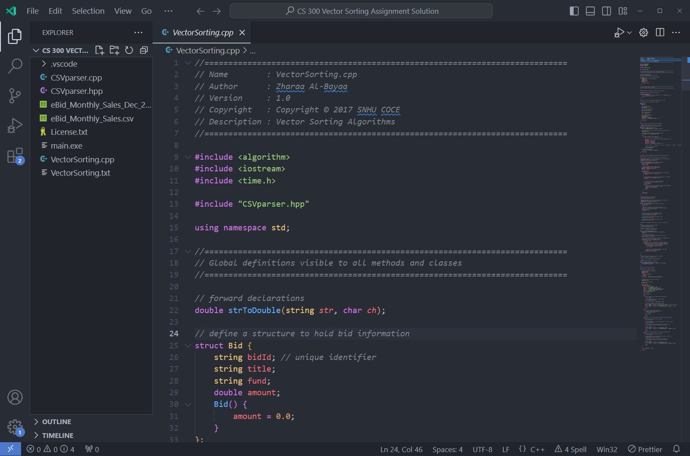
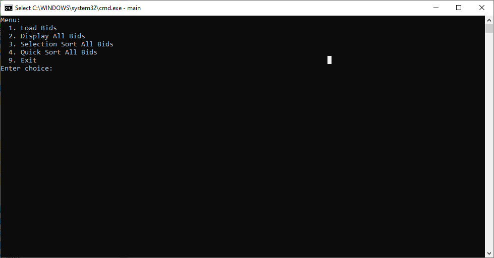
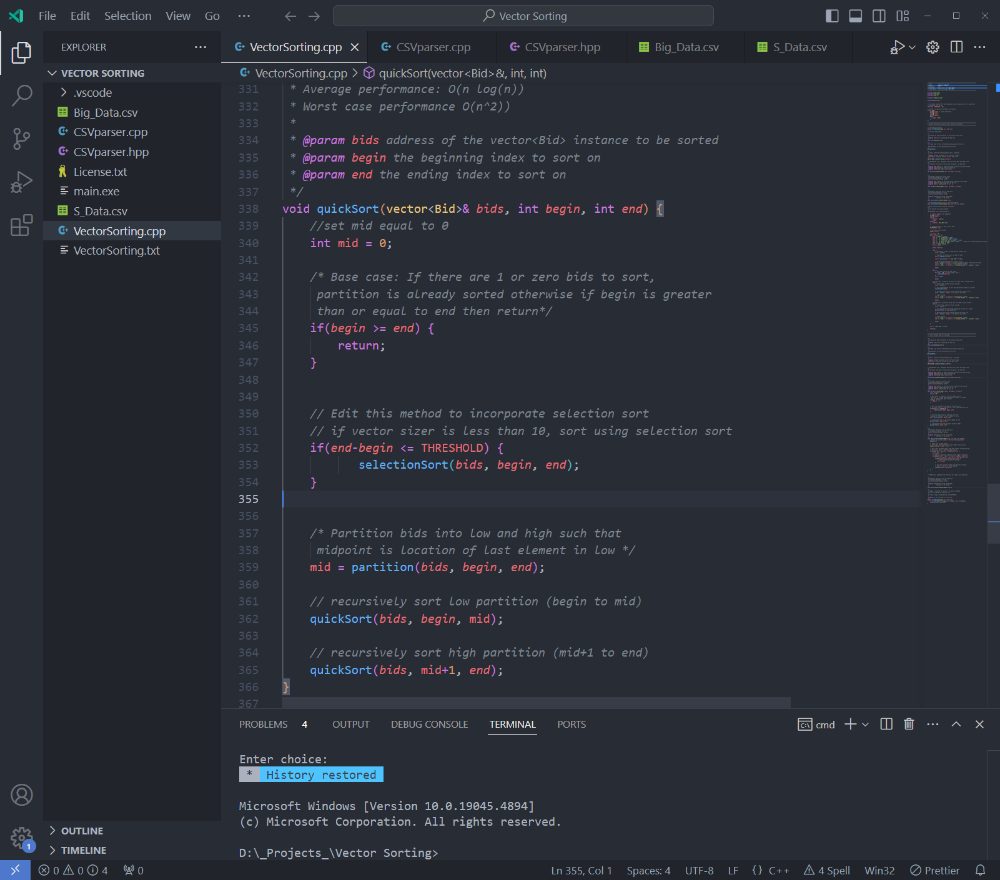

---

## Data Structures and Algorithms: Analysis and Design
## Algorithms and Data Structure Category

---

This artifact has been selected for the Algorithms and Data Structure Category from CS300 Data Structures and Algorithms: Analysis and Design. The application demonstrates reading datasets from a CSV file related to Bids and loading the data set into a vector. The Vector is then sorted using two different sorting algorithms Selection Sort and Quick Sort. This application is developed using C++ programming language and Visual Studio Code is used as an IDE with g++ GNU Compiler to compile the source code on Windows operating system. 

    <picture>
    <source media="(prefers-color-scheme: dark)" srcset="assets/code.png">
    <source media="(prefers-color-scheme: light)" srcset="assets/code.png">
    
    </picture>
    
<em>Screenshot of Existing Code</em>

This application and artifact involve File IO, Data Validation, Structs, Methods, Sorting Algorithms, and User Interaction via a Text-based menu. The artifact was developed using the best software development principles, secure coding, and best programming methods to address the intended application goals and objectives. The secure coding methodologies were adopted to reduce C++ coding vulnerabilities and reduce the risks of any malicious usage and invalid memory access by adopting measures to eliminate any memory overlapping and illegal access by limiting the vector size boundaries and indices. The data set has been loaded from an external file into the dynamic vector data structure that accommodates the data as long as memory is available in the operating system and avoids any memory exploitation. The application offers a Text-based menu to interact with the application and the user enters a menu option to carry out different functions offered by the application. This application uses a modular approach to address the application functionality that is extensible and easily adopted for future enhancements. 

    <picture>
    <source media="(prefers-color-scheme: dark)" srcset="assets/terminal.png">
    <source media="(prefers-color-scheme: light)" srcset="assets/terminal.png">
    
    </picture>
    
<em>Screenshot of application running in Terminal</em>

The Selection Sort is usually considered a slower sorting algorithm as compared to Quick Sort which is a faster sorting algorithm with O(NLogN) runtime on average and O(N^2) in the worst-case scenario. Whereas Selection sort is O(N^2) in all cases average and worst runtimes. Empirical studies show that Selection performs better when the data set is smaller for example consists of 10 elements as compared to Quick Sort. The artifact enhancement proposed for these Algorithms and Data structure categories comprised of introducing a Hybrid Sorting Algorithm by combining the forces of Selection Sort and Quick sort. The new hybrid algorithm will utilize selection sort whenever the dataset is fewer than 10 and use Quick sort for the larger dataset size. The new hybrid algorithm will be faster than the individual quick-sort algorithm. This is achieved by implementing a procedure that will verify the size of the dataset and calls Quick sort whenever there is a dataset larger than 10 and calls selection sort whenever it is less than or equal to the 10 shown in the following code snippet. 

    <picture>
    <source media="(prefers-color-scheme: dark)" srcset="assets/imporoved.png">
    <source media="(prefers-color-scheme: light)" srcset="assets/imporoved.png">
    
    </picture>
    
<em>Screenshot of improved code</em>

The enhancement of this artifact's industry-standard C++ coding rules and practices, minimized security vulnerabilities, memory violations, and buffer overflow. Coding is written with standard C++ conventions, naming conventions, indentation, self-explanatory variable names, and internal documentation with inline and block-level comments. The code is easier to read and comprehend, extensible, and maintainable because it is well structured and formatted to industry-level C++ standards. The code is tested manually to fix any logical error. The input errors are handled to avoid any program failure or crashes during the application execution. The code is compatible to run on Windows, Mac, and Linux using the latest g++ GNU Compiler with any IDE or simple text editor. The application can handle any size of data or any number of Bid records loaded from a CSV File as long as the file is properly formatted. 
